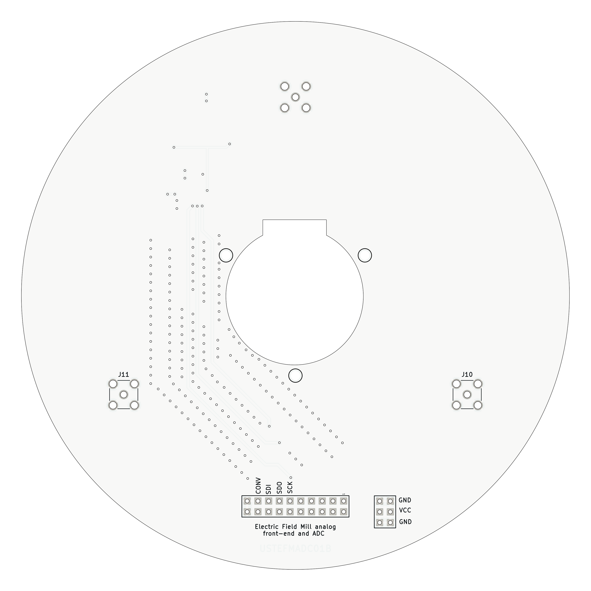

# EFMADC01 - Electric Field Mill ADC Module

The **EFMADC01** module is designed to provide an **analog front-end** and **ADC conversion** for [Electric Field Mill sensor](https://github.com/UniversalScientificTechnologies/THUNDERMILL01) development and experiments. It processes analog signals from the field mill electrodes and converts them into digital data for further processing.

## Features

- **High-Precision ADC**: Utilizes the **LTC1865** 16-bit, 250ksps analog-to-digital converter.
- **Low-Noise Analog Front End**: Incorporates **OPA314** operational amplifiers for signal conditioning.
- **Precision and stable Voltage Reference**: Includes a **1.25V reference** for accurate ADC operation.
- **Flexible Power Supply**: Supports **3.3V to 5V** operation.
- **RF Shielding**: Equipped with shielding to reduce external interference.
- **MCX Connector Input**: Enables high-quality signal connection.

## Functional Description

The **EFMADC01** module consists of three main blocks:

1. **Analog Front End (AFE)**:
   - Uses **OPA314** operational amplifiers for signal buffering and amplification.
   - High-impedance resistor (10MΩ) allows direct signal acquisition from the field mill sensor electrodes.

2. **ADC Conversion**:
   - **LTC1865-MS** ADC provides **16-bit resolution** with **250ksps sampling rate**.
   - Accepts differential input signals and supports SPI communication.

3. **Power and Reference**:
   - Powered by an external **3.3V or 5V** supply.
   - Features a **BZV55C-6.2V** Zener diode for overvoltage protection.
   - Uses a **1.25V precision voltage reference** for ADC stability.

## Hardware Connections

### Power Supply:
- **VCC**: Accepts **3.3V to 5V** input.
- **GNDA** and **GND**: Ground connections.

### Analog Input:
- **J9 (MCX Connector)**: Main analog signal input.
- **Operational amplifier stage** conditions the signal before ADC conversion.

## Typical Application

The **EFMADC01** module is primarily used in electric field mill experiments to measure atmospheric electric fields. It can also be employed in low-frequency scientific measurements where high-resolution ADC conversion is required.

## Schematic

For detailed circuit information, please take a look at the [EFMADC01 schematic](/doc/gen/EFMADC01-schematic.pdf) in the documentation.

    
